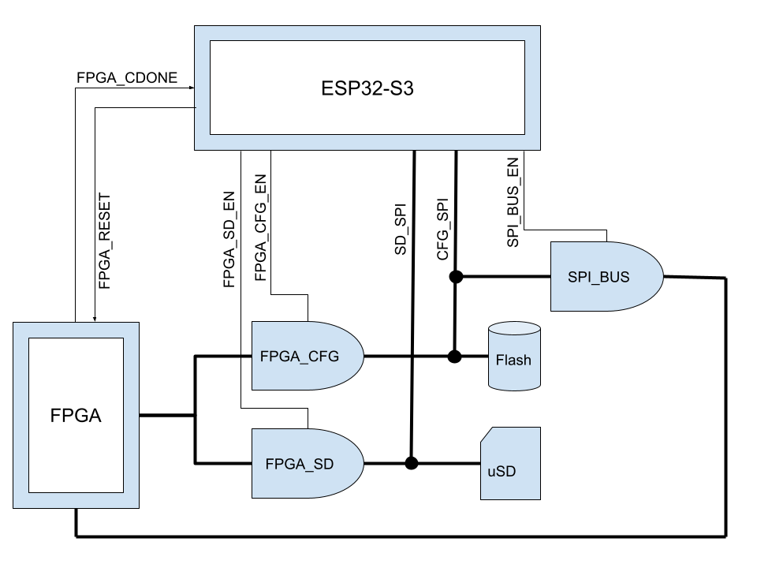

# SPI Crossbar

## Block Diagram

In the original VERA, SPI access was arbitrated by a simple mux and bus switch with the mux connection determined by the FPGA configuration
done (CDONE) signal. ESPIcial required a more complex system where the ESP32 could also communicate on the SPI busses for updating the
configuration firmware and writing files to the SD card. The following block diagram describes the logical connection between components and
related key signals on the SPI busses:

